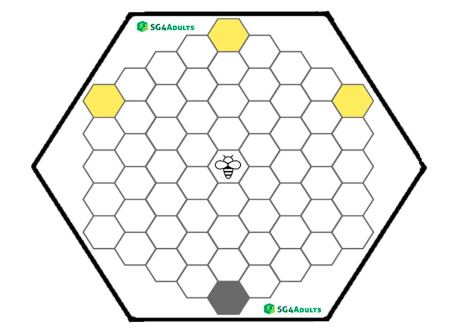

# Biz-E-Bee

#### Link to game: http://sg4adults.eu

## Summary

Erasmus + project SG4Adults developed a serious game to learn entrepreneurial skills: BIZ-E-BEE. In The Netherlands the game has been piloted amongst students at a bachelor's degree Social Work course, because entrepreneurship is a relevant topic for their future study and work.

Social workers have to deal with many different problems such as parenting issues, domestic violence, lack of money, poor housing, conflicts, psychological problems or a combination thereof. In training they learn how to find lasting solutions together with the client and in collaboration with other professionals. What do social work students need entrepreneurship for?

BIZ-E-BEE is designed based on a needs analysis conducted in six countries to (further) develop entrepreneurial skills. 80-85% of the respondents mentioned as main skills: taking initiative, innovative capacity, responsibility, confidence, communication skills and problem-solving skills. Followed closely by goal orientation, resilience, reliability and team building. Around these skills are assignments and exercises devised and incorporated into the game. Most of these skills are also mentioned in the Entrepreneurial Skills Pass. They also fit remarkably well with the profession of a social worker, although we see these not directly reflected in the Professional Social Work Code, published by the NVMW / BPSW.

## Score: Rank

<iframe width="600" height="371" seamless frameborder="0" scrolling="no" src="https://docs.google.com/spreadsheets/d/e/2PACX-1vRQeSSNa-R2e3TA_gbRtNTG3-69Q0TsvFACQQct_vCGbwvci6NYCB5iWdA0Nlzw5RUHCZdxqINldR5G/pubchart?oid=1515523664&amp;format=interactive"></iframe>

## Score: Weight

|           Evaluative Variables         |  Weight|
|:--------------------------------------:|:------:|
|              Task sequence             |   10   |
|            Fidelity of tasks           |   20   |
|           Quality of instructions      |   20   |
|         Instructor involvement         |    -   |
|  Learning outcomes outlined & achieved |    -   |
|               User choice              |   10   |
|          Cooperation (team learning)   |    -   |
| **Total**                              | **140**|

