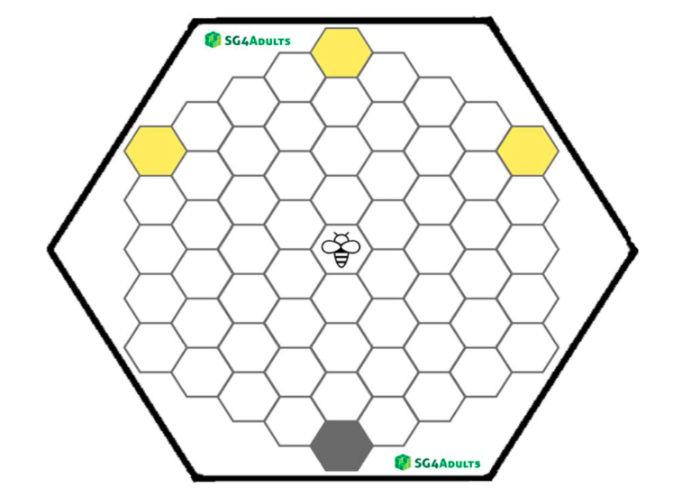
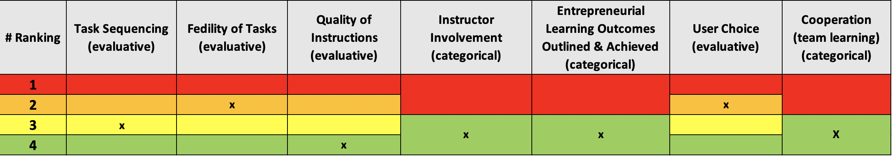

# Biz-E-Bee

#### Link zur Website: http://sg4adults.eu

## Zusammenfassung

Das Erasmus+ geförderte Projekt SG4Adults hat ein Serious Game zur Schulung unternehmerischer Fähigkeiten entwickelt: BIZ-E-BEE. In den Niederlanden wurde das Spiel unter Studierende eines Bachelor-Studiengangs für Soziale Arbeit getestet, da unternehmerisches Denken und Handeln sowohl für ihr zukünftiges Studium als auch ihre Arbeit relevant ist.

Sozialarbeiter werden in ihrem Beruf mit verschiedenen Problemen konfrontiert, wie z.B. Erziehungsfragen, häusliche Gewalt, Geldproblemen, prekären Wohnverhältnissen, persönlichen Konflikte, psychologischen Problemen oder Kombinationen davon. In ihrer Ausbildung lernen sie, wie sie gemeinsam mit dem Klienten sowie in Zusammenarbeit mit weiteren Fachleuten nachhaltige Lösungen für bestehende Probleme und Herausforderungen finden können. Aber weshalb ist es wichtig, dass Studierende der Sozialen Arbeit unternehmerisch Denken und Handeln können?

BIZ-E-BEE wurde auf Grundlage einer in sechs Ländern durchgeführten Bedarfsanalyse zur (Weiter-)Entwicklung unternehmerischer Fähigkeiten konzipiert. 80-85% der Befragten nannten als wichtigste Fähigkeiten: Initiative ergreifen, Innovationsfähigkeit, Verantwortungsbewusstsein, Selbstvertrauen, Kommunikationsfähigkeit und Problemlösungskompetenz. Dicht gefolgt von Zielorientierung, Belastbarkeit, Zuverlässigkeit und Teambuilding. Um diese Fähigkeiten herum wurden Aufgaben und Übungen entwickelt und in das Spiel eingebaut. Die meisten dieser Fähigkeiten werden auch im Entrepreneurial Skills Pass erwähnt. Sie passen auch bemerkenswert gut zum Beruf des Sozialarbeiters, obwohl sie sich nicht direkt im Professional Social Work Code, herausgegeben vom NVMW / BPSW, wiederfinden.

## Ergebnis: Rank

<iframe width="600" height="371" seamless frameborder="0" scrolling="no" src="https://docs.google.com/spreadsheets/d/e/2PACX-1vRQeSSNa-R2e3TA_gbRtNTG3-69Q0TsvFACQQct_vCGbwvci6NYCB5iWdA0Nlzw5RUHCZdxqINldR5G/pubchart?oid=1515523664&amp;format=interactive"></iframe>

**_Alle Bewertungsvariablen_**

## Ergebnis: Gewichtung

| **Evaluative Variable**               | **Gewichtung** |
| ------------------------------------- | ---------- |
| Aufgabenreihenfolge                   | 7,5        |
| Authentizität von Aufgaben            | 10         |
| Qualität der Anweisungen              | 20         |
| Einbeziehung Dozent*in                | \-         |
| Lernergebnisse unternehmerischer Bildung | \-         |
| Entscheidungsauswahl                  | 5          |
| Kooperation                           | \-         |
| **Total**                             | **42,5**   |
