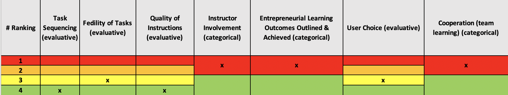

# Startup Game

#### Link zur Website: https://igrezadecu.com/hot-shot-business/

## Zusammenfassung

Das ursprünglich von Disney herausgegebene Hot Shot Business (HBS) ist ein beliebtes Online-Spiel, das die Eröffnung und Führung eines Unternehmens simuliert. 

Nachdem Sie ein Geschäft ausgewählt und ihm einen Namen gegeben haben, beginnen Sie durch die Hot Shot Business-Tools mit den Vorbereitungen für die große Ladeneröffnung. Die Benutzeroberfläche erlaubt es, mehrere Parameter für dieses Ereignis einzustellen.
HBS macht den Benutzer auch mit dem Thema Finanzmanagement im Spiel vertraut. Der Benutzer beginnt mit 2.500 Dollar auf seinem Konto, benötigt aber noch .2000 weitere, um die ersten Ziele zu erreichen. HBS lässt den Benutzer entscheiden, ob er sich den fehlenden Betrag von einer Bank leiht oder er Kontakt mit einem Investor aufnimmt. Die erste Option bedeutet, dass er jeden Monat eine Summe auszahlen muss. Entscheidet sich der Benutzer jedoch dafür, einen Teil seines Unternehmens abzugeben, muss er auch einen Teil seines Gewinns abgeben.

Als nächstes muss entschieden, welche Produkte oder Dienstleistungen der Benutzer in seinem Geschäft anbieten möchte. Bevor ein Kauf getätigt wird, bietet HBS eine Möglichkeit, spezielle Erfordernisse seiner Geschäftstätigkeiten einzusehen. Auf diese Weise kann der Benutzer beispielsweise herausfinden, was seine Kunden bevorzugen und dementsprechend zielführender investieren. Die Spieler müssen zudem erst die Anmietung von Geräten/Maschinen oder auch Ladeninventar abschließen, bevor sie dann irgendwann ihre Produkte verkaufen.

## Ergebnis: Rank

<iframe width="600" height="371" seamless frameborder="0" scrolling="no" src="https://docs.google.com/spreadsheets/d/e/2PACX-1vRQeSSNa-R2e3TA_gbRtNTG3-69Q0TsvFACQQct_vCGbwvci6NYCB5iWdA0Nlzw5RUHCZdxqINldR5G/pubchart?oid=1411411022&amp;format=interactive"></iframe>

**_Alle Bewertungsvariablen_**

## Ergebnis: Gewichtung

| **Evaluative Variable**               | **Gewichtung** |
| ------------------------------------- | ---------- |
| Aufgabenreihenfolge                   | 10         |
| Authentizität von Aufgaben            | 15         |
| Qualität der Anweisungen              | 20         |
| Einbeziehung Dozent*in                | \-         |
| Lernergebnisse unternehmerischer Bildung | \-         |
| Entscheidungsauswahl                  | 7,5        |
| Kooperation                           | \-         |
| **Total**                             | **52,5**   |
