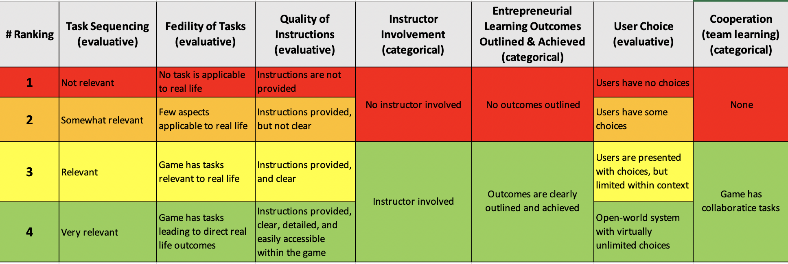

## Die Entrepreneurship Serious Game-Rubric - Ein quantifiziertes Spielbewertungssystem:

Der nächste Schritt auf dem Weg zur Feststellung von „Good-Practices“, beinhaltete die Erstellung und Implementierung eines quantifizierten Spielbewertungssystems.
Um faire und valide Quantifizierungen zu erreichen, wurde eine Reihe qualifizierender Variablen ausgewählt, die für die Feststellung von Best Practices bei Serious Games geeignet erschienen. Als Grundlage für die Auswahl dieser Variablen diente die ISGEE-Literaturreview, welche zu Beginn des Projekts umfassend vorgenommen wurde.

### Logik der Bewertungssystems: Variablen

Die Logik für die Auswahl der Variablen kann wie folgt beschrieben werden:

Es wurden 7 Variablen aufgrund ihrer Relevanz im ISGEE-Literaturreview ausgewählt. Diese Variablen wurden dann weiter aufgeteilt in;

1. Evaluationsvariablen: Jene Spielfaktoren die qualitativ bewertet werden können 

2. Kategoriale Variablen: Dichotome Spielfaktoren, die nur per "Ja/Nein"-Feststellung  betrachtet werden können

Die Variablen sind:
a.	**Aufgabenreihenfolge (qualitativ)** Beschreibt die Güte der Reihenfolge, in der das Spiel seine Aufgaben präsentiert. Gute Lernergebnisse in Serious Games (und in anderen Situationen) hängen auch von der Art der Aufgaben-Abfolge ab. Logisch aufeinander aufbauende Aufgaben können Informationen über eine kurze Anzahl von Schritten zielführend und somit besser vermitteln.

b.	**Authentizität von Aufgaben (qualitativ)**: Oftmals werden Aufgaben im Unterricht als nicht relevant erachtet, da sie keinen Bezug zu realen Situationen oder Kontexten aufweisen. Daher wurde auch die Authentizität von Aufgaben (d.h. in welchem Maße sie in die Realität übertragen werden könnten) als ein relevantes Kriterium für die Bewertung von Serious Games gewählt.

c.	**Qualität der Anweisungen (qualitativ)**: Eine gute Lernerfahrung muss von guten Lernzielen geleitet sein. Um dies zu gewährleisten, sollten dem Spieler des Serious Games klare und vollständige Anweisungen zur Verfügung gestellt werden, anhand derer der Spieler die direkten Zielstellungen der Aufgabe(n) erfassen und eine Vorgehensweise zur Aufgabenbearbeitung ableiten kann.

d.	**Einbeziehung Dozent*in ("Feedbackverfügbarkeit";"dichotom")** : Natürlich trägt die Beteiligung des/der Dozent/in an jeder Bildungsaktivität zur effektiven Vermittlung von Wissensvermittlung bei. Bei Serious Games kann die Einbindung des/der Dozent/in die (Lern-)Effizienz unmittelbar steigern (u.a. durch direkt Feedbackmöglichkeit sowie erhöhten Konzentration bei Anwesenheit von Dozent/in)

e.	**Lernergebnisse unternehmerischer Bildung(skizziert; dichotom)**: Analog zur Konzeption von Lehrveranstaltungen müssen bei Serious Games Lernergebnisse ebenfalls von den Entwicklern des Spiels definiert werden. Diese Lernergebnisse sollten nicht nur definiert, sondern auch durch den Ablauf des Spiels erreicht werden können.

f.	**Entscheidungsauswahl (qualitativ)**: Wenn man den Spielern im Spiel die Möglichkeit gibt Entscheidungen zu treffen, erzielen sie natürlich auch Lernergebnisse in Abhängigkeit ihrer jeweiligen Entscheidung. Über die Notwendigkeit zur Entscheidungswahl wird zudem die Einschätzung bzgl. der Fertigkeiten des Spielers ermöglicht (abhängig von der Aufgabe, der Art der Entscheidungsfindung sowie der getroffenen Entscheidung).

g.	**Kooperation (Lernen im Team; dichotom)**: Wissenschaftliche Studien zeigen , dass kollaboratives Lernen eine bessere Lerneffektivität im Vergleich zum individuellen Lernen bietet. Serious Games bieten eine einfache und effektive Umgebung für kollaborative Übungen. Die Umsetzung kann jedoch je nach den Prioritäten des Serious Games unterschiedlich sein.

## Logik der Bewertungssystems: Ranking

Kein Serious Games gleicht einem anderen zu 100%. So mag auch beispielsweise ein Spiel bei einer der oben aufgeführten Variablen gut abschneiden, aber (normalerweise) nicht bei allen. Um zu beurteilen, bei welcher Variablen ein Serious Game besser abschneidet, wurden die oben genannten Bewertungsfaktoren in ein 4-Punkte-Rankingsystem überführt. Dieses Ranking-System spiegelt die verschiedenen Ebenen wider, anhand derer ein Serious Game grundsätzlich bewertet werden kann. Beispielweise kann ein Spiel bzgl. seiner Aufgabenauthentizität gut abschneiden, aber wiederum schlecht im Bereich Entscheidungsauswahl. Das von uns erstellte Rankingsystem erlaubt folglich eine solche Unterscheidung.

Außerdem unterliegen die dichotomen Variablen nicht dem 4-Punkte-Bewertungssystem, da diese Variablen nur ja angeben, ob ein Spiel ein gewissen Kriterium erfüllt oder nicht ("Ja/Nein"-Logik).

Die verwendete 4er-Skala ist zusammen mit den bewertenden Variablen in Tabelle 2 dargestellt.

**Tabelle 2.**  Alle Bewertungsvariablen (qualitativ und dichotom) aufgeschlüsselt gemäß jeweiligem 4-Punkte-Bewertungssystem oder "Ja/Nein-Systematik". Rot (1) steht für die niedrigste, Grün (4) für die höchste Punktzahl.

Abschließend werden die Bewertungen der betrachteten Serious Games in Form von Netzdiagrammen visualisiert. Abbildung 1 zeigt ein Beispiel-Netzdiagramm eines Spiels.

**Abbildung 1:** Beispiel-Netzdiagramm zur Bewertung eines Spiels der Good-Practice Sammlung.

### Logik der Bewertungssystems: Variablen Gewichtung

Obwohl das 4-Punkte-Bewertungssystem hilft, Serious Games bezüglicher ihrer Variablenausprägungen zu unterscheiden, erfasst es nicht die unterschiedliche Relevanz der einzelnen Variablen untereinander. Den einzelnen Variablen wurden, je nach ihrer Bedeutung die Evaluation, unterschiedlich sowie in Form von Punkten gewichtet. Eine Bewertungs-Variable kann entweder ein Gewicht von 10 Punkten oder von 20 Punkten haben. Die Gewichtungen wurden im Rahmen eines Experten-Panels des ISGEE Projektes diskutiert und festgelegt.

Die Gewichtung jeder Variablen sind der Tabelle 3 zu.

| **Evaluative Variable**               | **Gewichtung** |
| ------------------------------------- | ---------- |
| Aufgabenreihenfolge                   | 10         |
| Authentizität von Aufgaben            | 20         |
| Qualität der Anweisungen              | 20         |
| Einbeziehung Dozent*in                | \-         |
| Lernergebnisse unternehmerischer Bildung | \-         |
| Entscheidungsauswahl                  | 10         |
| Kooperation                           | \-         |
| **Total**                             | **60**     |

**Tabelle 3.**  Alle Bewertungsvariablen, aufgeschlüsselt nach ihrer Gewichtung.

### Logik der Bewertungssystems: Gesamtpunkte

Die Gewichtungen und das 4-Punkte-Rating für die Bewertungsvariablen werden nachfolgend immer kombiniert dargestellt (Gesamtpunktzahl). Hierdurch wird es ermöglicht jedem Serious Game einzeln eine Gesamtpunktzahl zuzuordnen sowie die Spiele anhand ihrer Gesamtpunktzahl untereinander zu vergleichen.  
