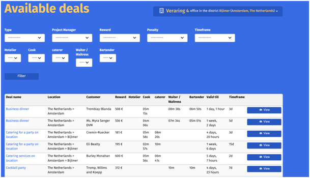
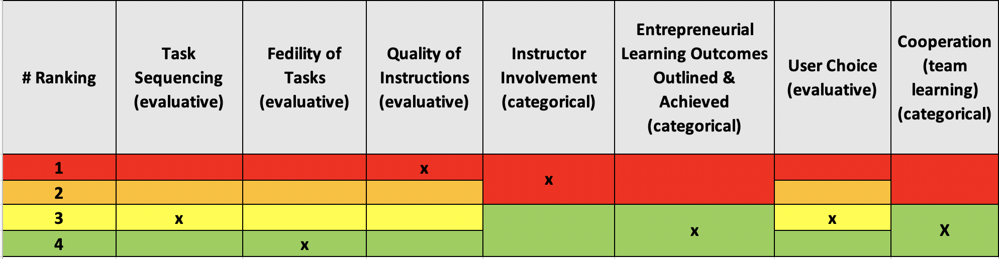

# SimBiz

#### Link to website: http://www.enterprisegame.eu/index.php/en/enterprise-game

#### Link to game: http://game.simbiz.eu/accounts/signup/

## Summary

SimBiz is a new exciting enterprise game. It is specially designed to develop your international enterprise skills.
SimBiz simulates real business activities – hence the name SimBiz – and presents you with realistic situations & events. By playing SimBiz you will learn & develop the key competences of an enterprising employee or entrepreneur.
The game presents you with many choices to:

- Rent offices: in your own country, later in other countriesHire personnel with specific skills
- Choose different deals that will generate income and brand points
- Place brand advertisements to expand your business
- React to random events that will impact on your business
- Compete with other players to try & be top of the SimBiz leaderboard

SimBiz offers an insight into your ability to be flexible, self-motivated, reliable, committed to your work and proactive: the key competences essential to international entrepreneurship.
A Handbook containing learning assignments accompanies the new game. Available in the five partnership languages, an international version of the handbook also encourages and allows individuals to play the enterprise game and compete against players from other countries.

Simbiz is a result of the Erasmus+ funded project “Entrepreneurship a Serious Game”.

## Score: Rank

<iframe width="600" height="371" seamless frameborder="0" scrolling="no" src="https://docs.google.com/spreadsheets/d/e/2PACX-1vRQeSSNa-R2e3TA_gbRtNTG3-69Q0TsvFACQQct_vCGbwvci6NYCB5iWdA0Nlzw5RUHCZdxqINldR5G/pubchart?oid=1028227620&amp;format=interactive"></iframe>

**_All Evaluative Variables_**

## Score: Weight

|         Evaluative Variables          | Weight |
| :-----------------------------------: | :----: |
|             Task sequence             |  7.5   |
|           Fidelity of tasks           |   20   |
|        Quality of instructions        |   5    |
|        Instructor involvement         |   -    |
| Learning outcomes outlined & achieved |   -    |
|              User choice              |  7.5   |
|      Cooperation (team learning)      |   -    |
|               **Total**               | **40** |
