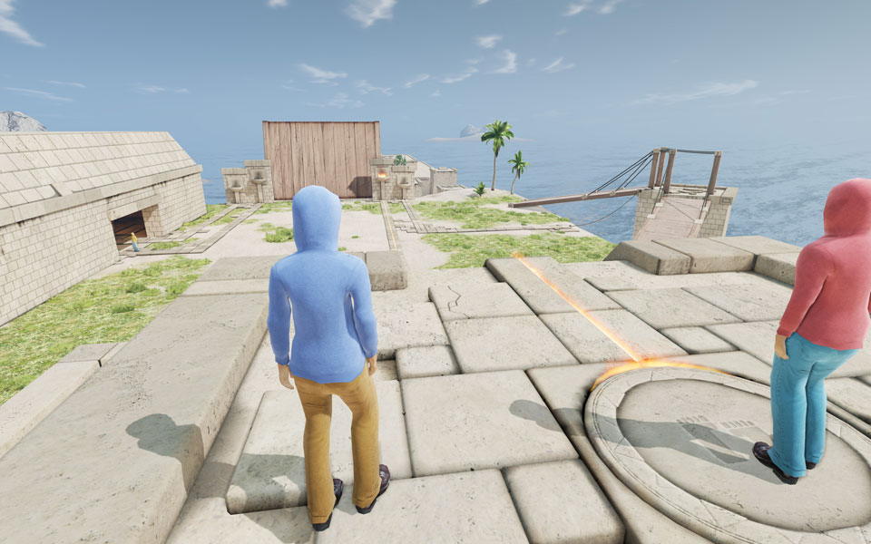
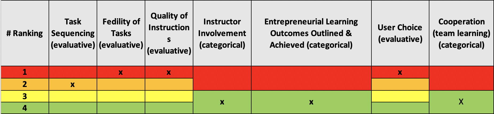

# TeamUp

#### Link to website: http://www.thebarngames.nl/teamup/teamup/index

## Summary

TeamUp is a serious game for teamwork workshops. Teams of four players have to work together to overcome a number of challenges within the game. These challenges are designed to emphasize the various elements of effective teamwork.

TeamUp is developed to support trainers. Although the experiences from the game itself can be very valuable for the players, the most effective learning comes from reflection. As such the game is designed specifically with extensive debriefing in mind.

Additionally, the game tracks all player actions to provide the trainer with very detailed reports on all of the players. This way the trainer can look up specific statistics such as the number of avoidable mistakes made by a specific group. Furthermore the trainer can use the debriefing tools to go back to specific moments of gameplay to discuss a team's thought process at that specific point in time.

## Score: Rank

<iframe width="600" height="371" seamless frameborder="0" scrolling="no" src="https://docs.google.com/spreadsheets/d/e/2PACX-1vRQeSSNa-R2e3TA_gbRtNTG3-69Q0TsvFACQQct_vCGbwvci6NYCB5iWdA0Nlzw5RUHCZdxqINldR5G/pubchart?oid=746340513&amp;format=interactive"></iframe>

**_All Evaluative Variables_**

## Score: Weight

|         Evaluative Variables          |  Weight  |
| :-----------------------------------: | :------: |
|             Task sequence             |    5     |
|           Fidelity of tasks           |    5     |
|        Quality of instructions        |    5     |
|        Instructor involvement         |    -     |
| Learning outcomes outlined & achieved |    -     |
|              User choice              |   2.5    |
|      Cooperation (team learning)      |    -     |
|               **Total**               | **17.5** |
