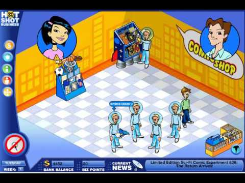
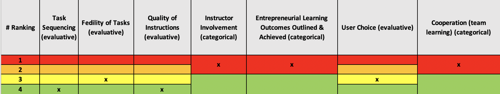

# Startup Game

#### Link to website: https://igrezadecu.com/hot-shot-business/

## Summary

Originally released by Disney, Hot Shot Business (HBS) is a popular online game that simulates opening and running an enterprise.
After picking a shop and naming it, use the Hot Shot Business tools to begin preparing for the grand opening. The user interface allows to set multiple parameters for this event.
HBS also exposes the user to in-game financial management. Users start with 2500 dollars in their account, but also need 2000 more to achieve the first few targets. HBS lets the user decide to either loan this missing amount from a bank or take on an investor. The first option means they need to pay out a sum every month. However, if the user chooses to give away part of their business, they will also have to give away some of their profit.
Next, it's time to decide on what products or services users offer in their store. Before making any purchase, HBS offers a way to see the needs of the business. This way the user can find out what their customers prefer and invest accordingly. Lastly, users start renting some machines or stands before selling their product.

## Score: Rank

<iframe width="600" height="371" seamless frameborder="0" scrolling="no" src="https://docs.google.com/spreadsheets/d/e/2PACX-1vRQeSSNa-R2e3TA_gbRtNTG3-69Q0TsvFACQQct_vCGbwvci6NYCB5iWdA0Nlzw5RUHCZdxqINldR5G/pubchart?oid=1411411022&amp;format=interactive"></iframe>

**_All Evaluative Variables_**

## Score: Weight

|         Evaluative Variables          |  Weight  |
| :-----------------------------------: | :------: |
|             Task sequence             |    10    |
|           Fidelity of tasks           |    15    |
|        Quality of instructions        |    20    |
|        Instructor involvement         |    -     |
| Learning outcomes outlined & achieved |    -     |
|              User choice              |   7.5    |
|      Cooperation (team learning)      |    -     |
|               **Total**               | **52.5** |
