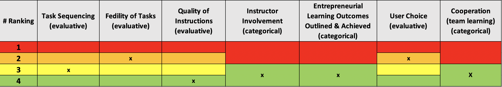

# Biz-E-Bee

#### Enlace al juego: http://sg4adults.eu

## Sumario

El proyecto Erasmus + SG4Adults desarrolló un juego serio para aprender habilidades empresariales: BIZ-E-BEE. En los Países Bajos, el juego se ha puesto a prueba entre los estudiantes de un curso de Licenciatura en Trabajo Social, porque el espíritu empresarial es un tema relevante para su estudio y trabajo futuros.

Los trabajadores sociales tienen que lidiar con muchos problemas diferentes, como problemas de crianza de los hijos, violencia doméstica, falta de dinero, vivienda deficiente, conflictos, problemas psicológicos o una combinación de ambos. En la formación aprenden a encontrar soluciones duraderas junto con el cliente y en colaboración con otros profesionales. ¿Para qué necesitan los estudiantes de trabajo social el espíritu empresarial?

BIZ-E-BEE está diseñado en base a un análisis de necesidades realizado en seis países para desarrollar (aún más) habilidades empresariales. El 80-85% de los encuestados mencionaron como habilidades principales: tomar la iniciativa, capacidad innovadora, responsabilidad, confianza, habilidades de comunicación y habilidades para la resolución de problemas. Seguido de cerca por la orientación a objetivos, la resistencia, la confiabilidad y la formación de equipos. En torno a estas habilidades se diseñan tareas y ejercicios que se incorporan al juego. La mayoría de estas habilidades también se mencionan en el Pase de Habilidades Empresariales. También encajan notablemente bien con la profesión de trabajador social, aunque vemos que estos no se reflejan directamente en el Código de Trabajo Social Profesional, publicado por la NVMW / BPSW..

## Score: categoría

<iframe width="600" height="371" seamless frameborder="0" scrolling="no" src="https://docs.google.com/spreadsheets/d/e/2PACX-1vRQeSSNa-R2e3TA_gbRtNTG3-69Q0TsvFACQQct_vCGbwvci6NYCB5iWdA0Nlzw5RUHCZdxqINldR5G/pubchart?oid=1515523664&amp;format=interactive"></iframe>

**_Todas las variables evaluativas_**

## Score: Peso

| **Variables evaluativas**            | **Peso** |
| ------------------------------------ | -------- |
| Secuencia de tarea                   | 7.5      |
| Fidelidad de tarea                   | 10       |
| Calidad de las intrucciones          | 20       |
| Implicación del instructor           | -        |
| Resultados de aprendizaje            | -        |
| Elección del usuario                 | 5        |
| Cooperación (aprendizaje de equipo ) | -        |
| **Total**                            | **42.5** |
