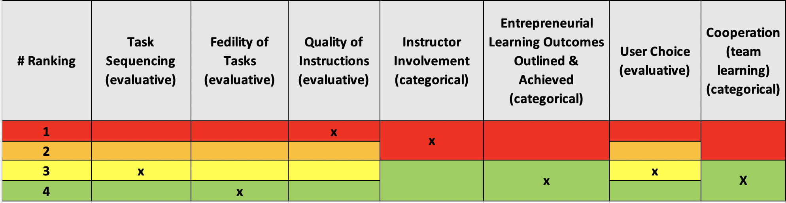

# SimBiz

#### Website: http://www.enterprisegame.eu/index.php/en/enterprise-game

#### Enlace al juego: http://game.simbiz.eu/accounts/signup/

## Sumario

SimBiz es un nuevo y emocionante juego de empresa. Está especialmente diseñado para desarrollar tus habilidades empresariales internacionales.
SimBiz simula actividades empresariales reales -de ahí el nombre de SimBiz- y te presenta situaciones y eventos realistas. Jugando a SimBiz aprenderás y desarrollarás las competencias clave de un empleado o empresario emprendedor.
El juego te presenta muchas opciones para:

- Alquilar oficinas: en tu propio país, después en otros paísesContratar personal con habilidades específicas
- Elegir diferentes negocios que generen ingresos y puntos de marca
- Colocar anuncios de marca para expandir tu negocio
- Reaccionar ante eventos aleatorios que repercutirán en tu negocio
- Compite con otros jugadores para intentar estar en lo más alto de la tabla de clasificación de SimBiz

SimBiz te permite conocer tu capacidad de ser flexible, automotivado, fiable, comprometido con tu trabajo y proactivo: las competencias clave esenciales para el emprendimiento internacional.
El nuevo juego va acompañado de un manual con tareas de aprendizaje. Disponible en las cinco lenguas de la asociación, una versión internacional del manual también anima y permite a los individuos jugar al juego de la empresa y competir contra jugadores de otros países.

Simbiz es el resultado del proyecto financiado por Erasmus+ "Entrepreneurship a Serious Game".

## Score: categoría

<iframe width="600" height="371" seamless frameborder="0" scrolling="no" src="https://docs.google.com/spreadsheets/d/e/2PACX-1vRQeSSNa-R2e3TA_gbRtNTG3-69Q0TsvFACQQct_vCGbwvci6NYCB5iWdA0Nlzw5RUHCZdxqINldR5G/pubchart?oid=1028227620&amp;format=interactive"></iframe>

**_Todas las variables evaluativas_**

## Score: Peso

| **Variables evaluativas**            | **Peso** |
| ------------------------------------ | -------- |
| Secuencia de tarea                   | 7.5      |
| Fidelidad de tarea                   | 20       |
| Calidad de las intrucciones          | 5        |
| Implicación del instructor           | \-       |
| Resultados de aprendizaje            | \-       |
| Elección del usuario                 | 7.5      |
| Cooperación (aprendizaje de equipo ) | \-       |
| **Total**                            | **40**   |
