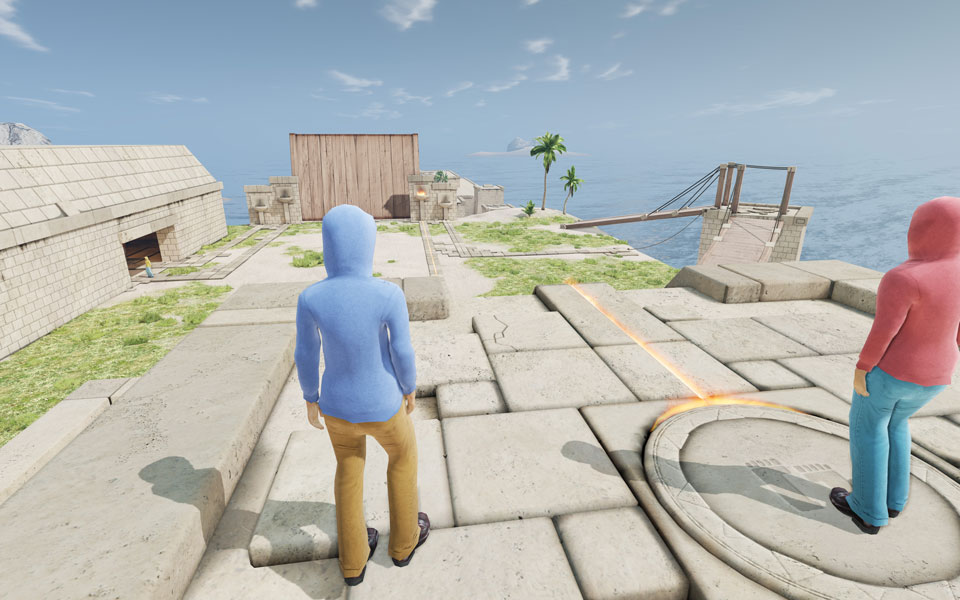

# TeamUp

#### Enlace al juego: http://www.thebarngames.nl/teamup/teamup/index

## Sumario

TeamUp es un juego serio para talleres de trabajo en equipo. Los equipos de cuatro jugadores deben trabajar juntos para superar una serie de desafíos dentro del juego. Estos desafíos están diseñados para enfatizar los diversos elementos del trabajo en equipo efectivo.

TeamUp está desarrollado para ayudar a los entrenadores. Aunque las experiencias del juego en sí pueden ser muy valiosas para los jugadores, el aprendizaje más efectivo proviene de la reflexión. Como tal, el juego está diseñado específicamente teniendo en cuenta un informe exhaustivo.

Además, el juego rastrea todas las acciones de los jugadores para proporcionar al entrenador informes muy detallados sobre todos los jugadores. De esta manera, el capacitador puede buscar estadísticas específicas, como el número de errores evitables cometidos por un grupo específico. Además, el entrenador puede usar las herramientas de información para volver a momentos específicos del juego para discutir el proceso de pensamiento de un equipo en ese momento específico.

## Score: categoría

<iframe width="600" height="371" seamless frameborder="0" scrolling="no" src="https://docs.google.com/spreadsheets/d/e/2PACX-1vRQeSSNa-R2e3TA_gbRtNTG3-69Q0TsvFACQQct_vCGbwvci6NYCB5iWdA0Nlzw5RUHCZdxqINldR5G/pubchart?oid=746340513&amp;format=interactive"></iframe>

**_Todas las variables evaluativas_**

## Score: Peso

| **Variables evaluativas**            | **Peso** |
| ------------------------------------ | -------- |
| Secuencia de tarea                   | 5        |
| Fidelidad de tarea                   | 5        |
| Calidad de las intrucciones          | 5        |
| Implicación del instructor           | -        |
| Resultados de aprendizaje            | -        |
| Elección del usuario                 | 2.5      |
| Cooperación (aprendizaje de equipo ) | -        |
| **Total**                            | **17.5** |
